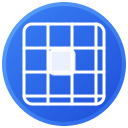

# Clarity - Advanced Tab Manager for Chrome

<div align="center">



**A beautiful, elegant, and powerful tab management extension for Google Chrome**

[](https://chrome.google.com/webstore)
[](LICENSE)
[](manifest.json)

</div>

## ✨ Features

### 🎨 **Beautiful & Elegant UI**
- Modern, clean interface with smooth animations
- Dark/light theme toggle with system detection
- Responsive design optimized for side panel
- Beautiful gradients and micro-interactions
- Accessibility-first design with screen reader support

### 🔍 **Advanced Search & Filtering**
- Real-time tab search with instant results
- Filter by: All tabs, Current window, Active only, Duplicates
- Search by title, URL, or domain
- Smart search highlighting and suggestions

### 📊 **Tab Statistics & Insights**
- Live statistics dashboard
- Track total tabs, active tabs, windows, and duplicates
- Session duration and productivity insights
- Domain usage analytics
- Tab limit monitoring with intelligent warnings

### 🎯 **Smart Tab Management**
- **Group by Domain**: Automatically organize tabs by website
- **Close Duplicates**: Remove duplicate tabs with one click
- **Suspend All**: Discard inactive tabs to save memory
- **Refresh All**: Bulk refresh multiple tabs
- **Pin/Unpin**: Quick tab pinning functionality

### ⚡ **Powerful Actions**
- **Context Menu Integration**: Right-click actions for quick management
- **Keyboard Shortcuts**: 
  - `Ctrl+Shift+Y` - Open Clarity Side Panel
  - `Ctrl+Shift+F` - Quick Tab Search
  - `Ctrl+K` - Focus Search Bar
  - `Arrow Keys` - Navigate through tabs
- **Batch Operations**: Select and act on multiple tabs
- **Window Management**: Merge windows, move tabs between windows

### 🌙 **Theme System**
- Light and dark mode support
- Smooth theme transitions
- High contrast mode support
- Customizable color schemes

### 🔄 **Background Processing**
- Real-time tab monitoring
- Automatic cleanup of old tabs
- Statistics tracking in background
- Performance optimization
- Memory usage monitoring

## 🚀 Installation

### From Chrome Web Store (Recommended)
1. Visit the [Chrome Web Store](https://chrome.google.com/webstore)
2. Search for "Clarity Tab Manager"
3. Click "Add to Chrome"
4. Grant necessary permissions
5. Start managing your tabs efficiently!

### Manual Installation (Development)
1. Clone this repository:
   ```bash
   git clone https://github.com/yourusername/clarity-chrome-ext.git
   cd clarity-chrome-ext
   ```

2. Open Chrome and navigate to `chrome://extensions/`

3. Enable "Developer mode" in the top right

4. Click "Load unpacked" and select the extension folder

5. The extension will appear in your extensions list

## 📖 Usage Guide

### Getting Started

1. **Open the Side Panel**: 
   - Click the Clarity icon in your toolbar

2. **Explore Your Tabs**:
   - View all your tabs in an organized grid
   - See real-time statistics at the top
   - Use the search bar to find specific tabs

3. **Basic Operations**:
   - Click any tab to switch to it
   - Use the pin button to keep important tabs
   - Close tabs with the × button
   - Duplicate tabs for quick reference

### Advanced Features

#### Search & Filter
- **Search**: Type in the search bar to filter tabs by title, URL, or domain
- **Filters**: Use the filter buttons to show specific tab groups
- **Clear Search**: Click the × button or press `Escape` to clear search

#### Tab Actions
- **Group by Domain**: Organize tabs by website into separate windows
- **Close Duplicates**: Remove all duplicate tabs automatically
- **Suspend All**: Discard inactive tabs to save memory (Chrome's built-in optimization)
- **Refresh All**: Reload all tabs at once

#### Context Menu
Right-click on any page to access:
- Close duplicate tabs
- Close tabs to left/right
- Close other tabs
- Move tab to new window
- Merge all windows


### Settings & Customization

#### Theme Settings
- **Light Mode**: Clean, bright interface
- **Dark Mode**: Easy on the eyes for night use

#### Tab Limits
- Set maximum tabs per window
- Receive warnings when limits are exceeded
- Automatic cleanup suggestions

#### Statistics
- Track your browsing habits
- Monitor session duration
- View most-visited domains
- Export usage data

## 🛠️ Technical Details

### Architecture
- **Manifest V3**: Latest Chrome extension standards
- **Service Worker**: Background processing and statistics
- **Side Panel API**: Modern Chrome extension UI
- **Storage API**: Settings and data persistence

### Technologies Used
- **HTML5**: Semantic, accessible markup
- **CSS3**: Modern design with custom properties
- **JavaScript ES6+**: Classes, async/await, modules
- **Chrome APIs**: Tabs, Windows, Storage, Commands

### File Structure
```
clarity-chrome-ext/
├── manifest.json                 # Extension manifest
├── README.md                     # Documentation
├── src/
│   ├── sidepanel.html           # Main UI
│   ├── sidepanel.css            # Styling & themes
│   ├── sidepanel.js             # Main application logic
│   └── service-worker.js        # Background processing
└── assets/
    └── icons/
        └── icon.svg             # Extension icon
```

### Performance Optimizations
- Lazy loading of tab data
- Efficient DOM manipulation
- Memory-conscious background processing
- Optimized search algorithms
- Smooth animations with CSS transforms

### Security & Privacy
- **Local Storage**: All data stored locally
- **Minimal Permissions**: Only requests necessary APIs
- **No Tracking**: No analytics or external data collection
- **Open Source**: Transparent code for security review

## 🔧 Development

### Prerequisites
- Google Chrome (latest version)
- Basic knowledge of HTML, CSS, JavaScript
- Understanding of Chrome Extension APIs

### Setup
1. Fork or clone the repository
2. Make your changes
3. Load the extension in developer mode
4. Test thoroughly

### Building for Production
1. Optimize images and assets
2. Minify CSS and JavaScript (optional)
3. Update version in `manifest.json`
4. Test in multiple Chrome profiles
5. Submit to Chrome Web Store

### Contributing
1. Fork the repository
2. Create a feature branch
3. Make your changes
4. Add tests if applicable
5. Submit a pull request

## 🐛 Troubleshooting

### Common Issues

**Extension not loading:**
- Ensure Developer Mode is enabled
- Check for manifest syntax errors
- Verify all file paths are correct

**Side panel not opening:**
- Check Chrome version compatibility
- Ensure side_panel permission in manifest
- Try reloading the extension

**Tabs not appearing:**
- Grant necessary permissions
- Check browser console for errors
- Restart the extension

**Performance issues:**
- Reduce number of open tabs
- Clear extension data and settings
- Check for memory leaks in browser

### Debug Mode
1. Open `chrome://extensions/`
2. Find Clarity Tab Manager
3. Click "Inspect views: sidepanel"
4. Check console for error messages

## 📄 License

This project is licensed under the MIT License - see the [LICENSE](LICENSE) file for details.

## 🙏 Acknowledgments

- Chrome Extensions Documentation
- Material Design Guidelines
- Open source community contributions
- Beta testers and feedback providers
